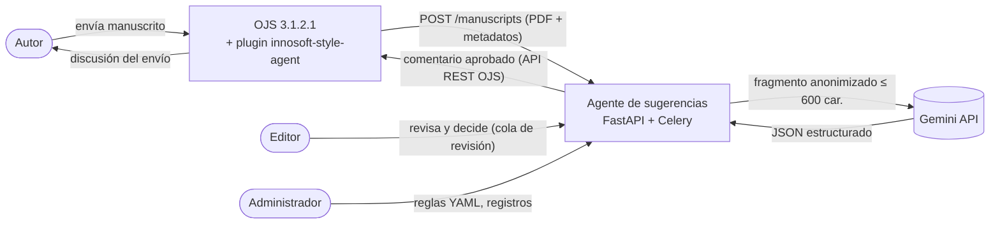
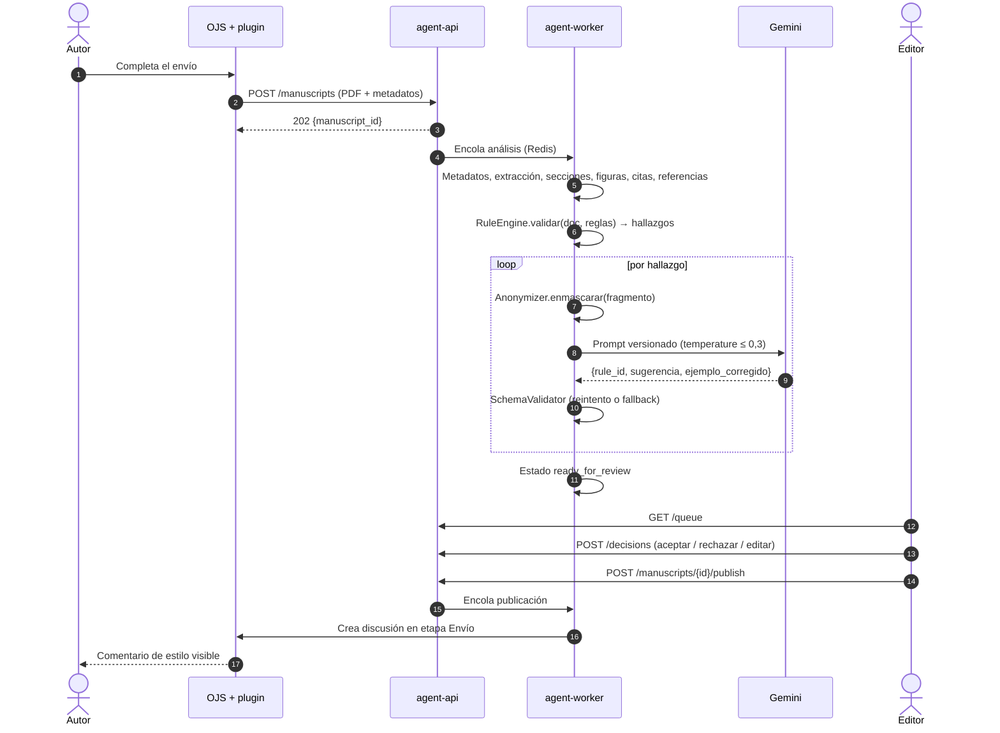
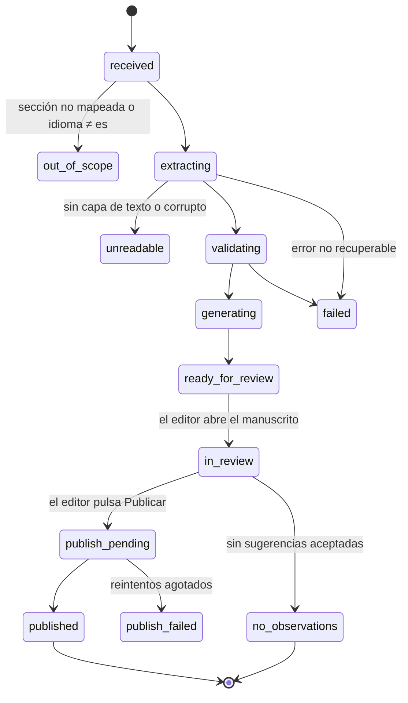
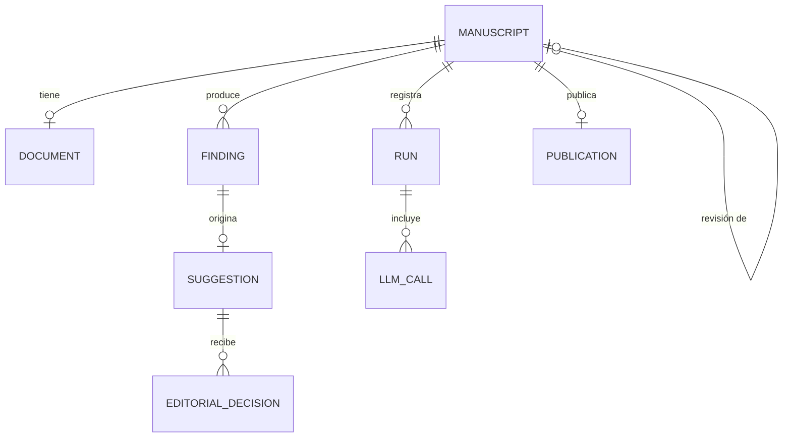

# Especificación general del producto

**Agente de sugerencias estilísticas para la revista *Innovación y Software* (Innosoft)**

> **Qué es este documento.** Es la spec de nivel superior del ciclo Spec-Driven Development (Capítulo III). Fija lo que es
> común a todas las historias: objetivo, alcance, actores, arquitectura, estados, contratos, requisitos no funcionales y
> flujos de excepción. Cada `specs/US-nn.md` describe **una** historia y se apoya en este documento; no repite lo que aquí
> se define.
>
> **Precedencia.** Si una spec de historia contradice este documento, prevalece este documento hasta que se publique una
> nueva versión de cualquiera de los dos mediante pull request. Los valores de las reglas editoriales no se definen aquí,
> sino en `rules/innosoft/*.yaml` según [`formato-reglas.md`](formato-reglas.md).

---

## 1. Objetivo

Desarrollar un agente de inteligencia artificial integrado con Open Journal Systems que analice los manuscritos enviados a
Innosoft en formato PDF, identifique incumplimientos respecto de las normas editoriales de la revista y genere sugerencias
estilísticas claras, trazables y revisables por un editor.

**Problema que resuelve.** En la evaluación editorial inicial, el editor revisa a mano el estilo de cada manuscrito. Los
problemas más frecuentes son figuras con etiquetas incorrectas, demasiado pequeñas o recortadas, y referencias que no siguen
el formato IEEE. El agente automatiza la detección y la redacción; el editor conserva la decisión.

**Criterio de éxito del producto (evaluación del Sprint 6).**

| Métrica | Definición | Meta inicial |
|---|---|---|
| Precisión por regla | Hallazgos correctos / hallazgos emitidos, sobre un corpus anotado | ≥ 0,85 en reglas D |
| Recall por regla | Hallazgos correctos / incumplimientos reales anotados | ≥ 0,75 en reglas D |
| Tasa de aceptación | (aceptadas + editadas) / sugerencias decididas por el editor | ≥ 70 % |
| Tiempo de análisis | Envío recibido → `ready_for_review` para un artículo original de 15 páginas | < 3 min (RNF-03) |

_Las metas son propuestas del equipo y se confirman con el asesor antes del Sprint 6._

## 2. Alcance

**Incluye**

- Manuscritos en español enviados a las secciones *Artículo corto*, *Artículo original* y *Artículo de revisión*.
- Etapa de corrección de estilo en la evaluación editorial inicial, **antes** de la revisión por pares.
- Entrada en PDF (el equipo editorial convierte DOCX y LaTeX a PDF).
- Reglas editoriales RE-01..RE-66 del catálogo, priorizadas por release.
- Revisión humana obligatoria de cada sugerencia y publicación como discusión en OJS.

**No incluye**

- Revisión de contenido científico, originalidad o plagio.
- Corrección ortográfica y gramatical general.
- OCR de PDFs escaneados (se rechazan de forma controlada, ALT-01).
- Manuscritos en inglés (ALT-08) y secciones distintas de las tres anteriores (ALT-07).
- Modificación del PDF del autor: el agente sugiere, no corrige.

## 3. Actores

| Actor | Tipo | Responsabilidad | Interactúa con el agente |
|---|---|---|---|
| Autor | Humano | Envía el manuscrito; recibe el comentario aprobado en OJS. | No, solo a través de OJS |
| Editor / editor de sección | Humano | Revisa, acepta, rechaza o edita sugerencias; publica. | Sí (cola de revisión) |
| Administrador | Humano | Gestiona reglas, credenciales y registros. | Sí (endpoints de administración) |
| Plugin OJS (`innosoft-style-agent`) | Sistema | Detecta el envío, entrega PDF + metadatos, publica el comentario. | Sí (API) |
| Agente | Sistema | Extrae, valida, genera sugerencias, expone la cola. | — |
| Gemini API | Sistema externo | Redacta sugerencias a partir de hallazgos anonimizados. | Sí (saliente) |

## 4. Contexto del sistema



## 5. Arquitectura

### 5.1 Despliegue (resumen de `diagramas/despliegue_innosoft`)

| Nodo | Componentes | Notas |
|---|---|---|
| Servidor de la revista (Universidad La Salle, Linux) | Apache 2.4 + PHP · OJS 3.1.2.1 · plugin `innosoft-style-agent` · MySQL 5.7 (`ojs_db`) | El plugin escucha el hook de envío completado (US-02) y publica vía API REST (US-24). |
| Servidor del agente (Linux, Docker Engine) | `agent-api` (FastAPI + Uvicorn :8000) · `agent-worker` (Celery: extracción PyMuPDF, motor de reglas, generador de sugerencias, publicador) · Redis 7 (cola de trabajos) · PostgreSQL 16 (`agent_db`) · volumen `/srv/innosoft` (PDFs, `rules/*.yaml`) | Arquitectura objetivo. En la primera etapa `agent-api` ejecuta el análisis con `BackgroundTasks`; `agent-worker` (Celery) y Redis se incorporan después sin cambiar la API (D-04). |
| Google Cloud | Gemini API | Solo recibe fragmentos anonimizados (US-17). |
| Estación de trabajo | Navegador del editor y del autor | Interfaz web de OJS y cola de revisión (sesión OJS o token de editor). |

### 5.2 Módulos lógicos (resumen de `diagramas/clases_innosoft`)

| Paquete | Clases principales | Responsabilidad | Historias |
|---|---|---|---|
| `api` | `ManuscriptController` | Recibir manuscritos, exponer la cola y registrar decisiones. | US-01, US-19..US-21 |
| `extraction` | `PdfExtractor` (interfaz), `PyMuPdfExtractor`, `SectionDetector`, `FigureExtractor`, `ReferenceParser` | Convertir el PDF en un `Document` estructurado. | US-04..US-08, US-34, US-35 |
| `model.document` | `Manuscript`, `Document`, `Section`, `Figure`, `Citation`, `Reference` | Modelo del manuscrito y su contenido. | Transversal |
| `rules` | `RuleRepository`, `Rule`, `RuleEngine`, `Validator` (abstracta), `FigureValidator`, `CitationValidator`, `ReferenceValidator`, `StructureValidator`, `Finding` | Cargar reglas YAML y producir hallazgos. | US-09..US-14, US-30, US-36 |
| `suggestion` | `SuggestionGenerator`, `Anonymizer`, `PromptBuilder`, `SchemaValidator`, `LlmClient` (interfaz), `GeminiClient`, `Suggestion` | Convertir hallazgos en sugerencias redactadas. | US-15..US-18 |
| `review & publishing` | `ReviewService`, `EditorialDecision`, `CommentComposer`, `OjsGateway` (interfaz), `OjsRestClient`, `Run` | Revisión humana, publicación en OJS y registro. | US-19..US-28 |

Las interfaces `PdfExtractor`, `LlmClient` y `OjsGateway` existen para poder sustituir PyMuPDF, Gemini u OJS por dobles de
prueba en Pytest y, a futuro, por otras implementaciones.

## 6. Flujo principal (happy path)



## 7. Estados

### 7.1 Manuscrito



| Estado | Significado | Visible en la cola |
|---|---|---|
| `received` | PDF y metadatos persistidos (US-01). | No |
| `out_of_scope` | Sección no mapeada o idioma distinto de español (US-03). | Sí, con motivo |
| `extracting`, `validating`, `generating` | Análisis en curso en el worker. | No |
| `unreadable` | PDF escaneado, corrupto o cifrado (US-04). | Sí, con motivo |
| `ready_for_review` | Sugerencias listas. | Sí |
| `in_review` | Al menos una decisión registrada. | Sí |
| `publish_pending` | Publicación encolada o en reintento (US-25). | Sí |
| `published` | Comentario creado en OJS (US-24). | No (historial) |
| `no_observations` | Cerrado sin comentario (US-23). | No (historial) |
| `publish_failed`, `failed` | Error que requiere intervención; el manuscrito se conserva (RNF-06). | Sí, con motivo |

### 7.2 Sugerencia

`proposed → accepted | edited | rejected`. Una sugerencia `manual` (US-22) nace `accepted`. Toda transición crea un
registro `EditorialDecision` con editor, acción, fecha, texto original y texto final (US-21).

## 8. Contratos

### 8.1 Entradas del sistema

| Entrada | Formato | Restricciones |
|---|---|---|
| Manuscrito | PDF | ≤ 25 MB, con capa de texto. |
| Metadatos del envío | JSON | `submission_id` (obligatorio), `section_id`, `title`, `locale`, `revision`, `submitted_at`. |
| Reglas editoriales | YAML | Según `formato-reglas.md`. |
| Decisiones del editor | JSON | `{suggestion_id, action, text?, reason?, version}`. |

### 8.2 Salidas del sistema

| Salida | Formato | Definida en |
|---|---|---|
| Hallazgo (`Finding`) | `{rule_id, severidad, pagina, ubicacion, evidencia, valor_encontrado, valor_esperado}` | `formato-reglas.md` §9 |
| Sugerencia | `{id, finding_id, rule_id, texto, ejemplo_corregido?, origen: llm/fallback/manual, estado}` | US-15, US-16 |
| Comentario en OJS | Discusión en la etapa *Envío*, agrupada por categoría, con página y directriz; firma "Revisión asistida por IA, validada por el editor" | US-24 |
| Registro de ejecución | Tabla `runs` / `run_stages` | US-28 |

### 8.3 API del agente (nombres canónicos)

| Método y ruta | Rol | Historia |
|---|---|---|
| `POST /manuscripts` | Plugin (token de servicio) | US-01 |
| `GET /manuscripts/{id}` | Editor | US-20 |
| `GET /manuscripts/{id}/findings` | Editor / desarrollo | US-10 |
| `GET /manuscripts/{id}/suggestions` | Editor | US-20 |
| `POST /manuscripts/{id}/suggestions` | Editor (sugerencia manual) | US-22 |
| `POST /manuscripts/{id}/no-observations` | Editor | US-23 |
| `POST /manuscripts/{id}/publish` | Editor | US-24 |
| `GET /queue` | Editor | US-19 |
| `POST /decisions` | Editor | US-21 |
| `GET /rules?section=` | Editor / administrador | US-09 |
| `POST /admin/rules/reload` | Administrador | US-30 |
| `GET /runs?manuscript_id=` | Administrador | US-28 |
| `GET /health` | Monitoreo | US-00 |

La especificación OpenAPI se genera desde FastAPI (`/docs`) y se consolida en el Sprint 3.

### 8.4 Modelo de datos (esbozo)



| Tabla | Campos clave |
|---|---|
| `manuscripts` | `id`, `submission_id`, `revision`, `parent_id`, `article_type`, `language`, `title`, `sha256`, `status`, `status_reason`, `created_at` |
| `documents` | `manuscript_id`, `pages` (JSONB), `sections`, `figures`, `citations`, `references` (JSONB) |
| `findings` | `id`, `manuscript_id`, `run_id`, `rule_id`, `severidad`, `pagina`, `ubicacion`, `evidencia`, `valor_encontrado`, `valor_esperado`, `requires_llm` |
| `suggestions` | `id`, `finding_id`, `rule_id`, `texto`, `ejemplo_corregido`, `origen`, `estado`, `prompt_version`, `model`, `version` |
| `decisions` | `id`, `suggestion_id`, `accion`, `texto_original`, `texto_final`, `motivo`, `editor_id`, `fecha` |
| `publications` | `manuscript_id`, `revision`, `ojs_query_id`, `body_sha256`, `published_by`, `published_at` |
| `runs`, `run_stages`, `llm_calls`, `llm_payloads` | Observabilidad (US-28, US-29, US-17) |

## 9. Principios transversales

1. **Humano en el ciclo.** Ninguna sugerencia llega al autor sin la acción explícita de un editor (RNF-01).
2. **El motor decide, el LLM redacta.** Qué es un incumplimiento lo determina el motor de reglas; Gemini solo redacta el hallazgo. El LLM no crea ni elimina hallazgos.
3. **Trazabilidad por IDs.** `RE-nn → Finding → Suggestion → EditorialDecision → Publication` (RNF-04). Ningún objeto pierde el `rule_id`.
4. **Política fuera del código.** Umbrales, mensajes y reglas activas viven en YAML (RNF-05).
5. **Fallar por partes.** Un error en una regla, una llamada a Gemini o la publicación no pierde el manuscrito ni bloquea el envío del autor (RNF-06).
6. **Mínima exposición de datos.** A Gemini solo sale el fragmento necesario, anonimizado (RNF-02, Ley N.º 29733).
7. **Todo versionado.** Código, specs, reglas y prompts en GitHub (RNF-07).
8. **Español.** La interfaz, las sugerencias y los mensajes se redactan en español; los identificadores de código, en inglés.

## 10. Requisitos no funcionales

| ID | Requisito | Cómo se cumple | Verificación | Historias |
|---|---|---|---|---|
| RNF-01 | Ninguna sugerencia llega al autor sin aprobación humana | Publicación solo mediante `POST /manuscripts/{id}/publish` con rol editor | Prueba E2E: sin acción del editor no existe comentario en OJS | US-21, US-24 |
| RNF-02 | Datos personales no salen a Gemini (Ley 29733) | `Anonymizer` + fragmento ≤ 600 caracteres + registro de payloads | Prueba de US-17 + inspección de `llm_payloads` | US-17 |
| RNF-03 | Análisis de un artículo original (15 pág.) < 3 min | Worker asíncrono; presupuesto de tokens | Medición en `runs` | US-28 |
| RNF-04 | Trazabilidad regla → hallazgo → sugerencia → decisión → comentario | IDs propagados; validación de `rule_id` | Matriz de trazabilidad | US-16, US-33 |
| RNF-05 | Reglas editables sin cambiar código | YAML + JSON Schema + recarga | Cambio de umbral sin commit de código | US-09, US-30 |
| RNF-06 | Un fallo de etapa no pierde el manuscrito ni bloquea el envío | Estados de error, reintentos, outbox | ALT-01, ALT-05, ALT-10 | US-02, US-18, US-25 |
| RNF-07 | Todo versionado en GitHub | Repositorio único con `specs/`, `rules/`, `prompts/` | Revisión del repositorio | US-00 |

## 11. Flujos alternativos y de excepción

| ID | Situación | Comportamiento del sistema | Historia |
|---|---|---|---|
| ALT-01 | PDF sin capa de texto o corrupto | Estado `unreadable` con motivo; aviso al editor en la cola | US-04 |
| ALT-02 | No se detectan secciones estándar | Se reporta como incumplimiento (RE-09), no como error | US-05, US-14 |
| ALT-03 | Manuscrito sin figuras | Reglas de figura omitidas, no fallan | US-06 |
| ALT-04 | Referencias sin numerar o formato mixto APA + IEEE | Se extraen ambos estilos; RE-43 y RE-47 lo reportan | US-12, US-13 |
| ALT-05 | Gemini no responde, excede cuota o devuelve JSON inválido | Un reintento de formato, backoff de red y fallback determinístico | US-16, US-18 |
| ALT-06 | El editor rechaza todas las sugerencias | No se publica comentario; estado `no_observations` | US-23 |
| ALT-07 | Sección de OJS no mapeada | `out_of_scope/unmapped_section`; se registra | US-03 |
| ALT-08 | Manuscrito en inglés | `out_of_scope/language`; aviso al editor | US-03 |
| ALT-09 | El autor reenvía una versión corregida | Nuevo análisis vinculado; comentario "Revisión n" | US-31, US-26 |
| ALT-10 | API de OJS caída al publicar | `publish_pending` y reintentos con outbox | US-25 |
| ALT-11 | El PDF contiene datos personales | Solo sale a Gemini el fragmento anonimizado | US-17 |
| ALT-12 | Dos editores revisan el mismo manuscrito | Bloqueo optimista; 409 al segundo; todo queda registrado | US-21 |

## 12. Stack tecnológico

| Capa | Tecnología |
|---|---|
| Lenguaje | Python 3.11 o superior |
| API | FastAPI + Uvicorn, Pydantic |
| Trabajo asíncrono | `BackgroundTasks` de FastAPI en la primera etapa; Celery + Redis 7 después (D-04) |
| Persistencia | PostgreSQL 16 (JSONB para el `Document`), Alembic para migraciones |
| Extracción PDF | PyMuPDF |
| Reglas | YAML + JSON Schema (`jsonschema`) |
| LLM | Gemini API (modelo configurable, `temperature ≤ 0,3`, salida JSON con esquema) |
| Pruebas | Pytest; GitHub Actions |
| Contenedores | Docker Compose (`agent-api`, `db`; luego `agent-worker`, `redis`) |
| Integración | Plugin genérico PHP para OJS 3.1.2.1 (Apache 2.4, MySQL 5.7) |

## 13. Estructura del repositorio

```text
innosoft-style-agent/
├── app/
│   ├── api/            # ManuscriptController y endpoints
│   ├── extraction/     # PyMuPdfExtractor, SectionDetector, FigureExtractor, ReferenceParser
│   ├── models/         # Manuscript, Document, Finding, Suggestion, Decision, Run
│   ├── rules/          # RuleRepository, RuleEngine, evaluators/
│   ├── suggestion/     # Anonymizer, PromptBuilder, SchemaValidator, GeminiClient
│   ├── review/         # ReviewService, decisiones, cola
│   ├── ojs/            # CommentComposer, OjsRestClient, outbox
│   └── workers/        # tareas Celery
├── ojs-plugin/innosoftStyleAgent/   # plugin PHP para OJS 3.1.2.1
├── rules/
│   ├── innosoft/       # estructura.yaml, figuras.yaml, citas.yaml, referencias.yaml, formato.yaml
│   └── schema/rule.schema.json
├── prompts/sugerencia/ # v1.md, v2.md, … (versionados)
├── specs/              # 00-producto.md, formato-reglas.md, _template.md, US-nn.md
├── tests/              # test_usNN_*.py, rules/test_RE-nn.py, fixtures/pdfs/
├── docs/               # plantillas oficiales, innosoft.cls, diagramas
├── alembic/
├── docker-compose.yml
└── .github/workflows/ci.yml
```

## 14. Proceso de desarrollo

- **Scrum:** sprints de 2 semanas del 14-sep al 04-dic-2026; Product Owner y Scrum Master asumidos por los dos developers.
- **Priorización:** RICE (`priorizacion_rice_sprint1.xlsx`); release R1 = MVP (Sprints 1-5), R2 = mejoras, R3 = futuro.
- **Ciclo SDD por historia:** Especificar → Revisar → Planificar → Implementar → Verificar → Cerrar (ver `README.md`).
- **Definition of Done:**
  1. La spec existe, fue revisada por el otro developer y coincide con lo implementado.
  2. Pruebas Pytest en verde en GitHub Actions.
  3. Código en `main` mediante pull request revisado.
  4. Cada hallazgo devuelto tiene `rule_id` trazable a `rules/*.yaml`.
  5. Demo reproducible con `docker compose up` + `curl` en la Sprint Review.

## 15. Glosario

| Término | Definición |
|---|---|
| Hallazgo (`Finding`) | Incumplimiento de una regla detectado por el motor, con ubicación y evidencia. |
| Sugerencia | Redacción del hallazgo dirigida al autor (LLM, fallback o manual). |
| Fallback determinístico | Sugerencia construida con el `mensaje` de la regla cuando el LLM no está disponible o responde mal. |
| Walking skeleton | Versión mínima del flujo de punta a punta (historias ★ del User Story Map). |
| Discusión (OJS) | Hilo de mensajes (*query*) asociado a una etapa del envío en OJS. |
| Tipo de artículo | `corto`, `original` o `revision`, derivado de la sección de OJS. |

## 16. Consistencia entre artefactos (pendiente de corregir)

Se revisaron los diagramas contra el catálogo y el Excel. Se adoptan los nombres de la columna **Canónico**; el artefacto
de la columna **Corregir** debe actualizarse.

| Tema | Canónico | Corregir |
|---|---|---|
| Carpeta de reglas | `rules/innosoft/*.yaml` (catálogo, Excel, DoD) | ✅ Corregido en el diagrama de clases |
| Plantilla de prompt | `prompts/sugerencia/vN.md` | ✅ Corregido en el diagrama de clases |
| Endpoints de revisión | `GET /queue`, `POST /decisions` (diagrama de despliegue) | — (specs US-19 y US-21 alineadas) |
| Estados de sugerencia | Código: `proposed / accepted / edited / rejected`; diagrama: *propuesta / aceptada / editada / rechazada* | Equivalentes; no requiere cambio |

## 17. Decisiones de la revisión

| ID | Decisión | Specs afectadas |
|---|---|---|
| D-01 | Un reenvío idéntico (mismo `submission_id` y `sha256`) devuelve el manuscrito existente con `200 OK`; no se duplica ni se re-analiza. | US-01, US-31 |
| D-02 | RE-22 (figura dentro de márgenes) sale de US-10 y se evalúa en US-35. | US-10, US-35, formato-reglas |
| D-03 | Supuesto aprobado para RE-20: mínimo 531 × 1328 px (alto × ancho) para toda figura raster; la variante panorámica 200 × 500 se añadirá al YAML si la revista la precisa. | US-10, formato-reglas |
| D-04 | Procesamiento asíncrono con `BackgroundTasks` de FastAPI en la primera etapa; Celery + Redis se incorporan después sin cambiar los contratos. | US-00, US-01, 00-producto |

## 18. Preguntas abiertas

- [ ] ¿Quién hará las veces de *stakeholder* editorial en las Sprint Reviews (editor jefe de Innosoft)?
- [ ] Corpus anotado para medir precisión y recall: ¿cuántos manuscritos históricos se pueden usar y bajo qué autorización?
- [ ] Hosting del servidor del agente: ¿infraestructura de la universidad o nube?
- [ ] Cuenta y presupuesto de Gemini API.

## 19. Aprobación

| Rol | Estado | Fecha | Firma / PR |
|---|---|---|---|
| Developer A (PO / SM) | Aprobada | 2026-09-29 | |
| Developer B | Aprobada | 2026-09-29 | |

## Historial de cambios

| Versión | Fecha | Autor | Cambio |
|---|---|---|---|
| 0.1 | 2026-09-29 | Equipo | Borrador inicial a partir del catálogo v1.0, la priorización RICE y los diagramas de clases y despliegue. |
| 1.0 | 2026-09-29 | Dev A, Dev B | Aprobada. Incorpora las decisiones D-01 a D-04 y la corrección de rutas del diagrama de clases. |
